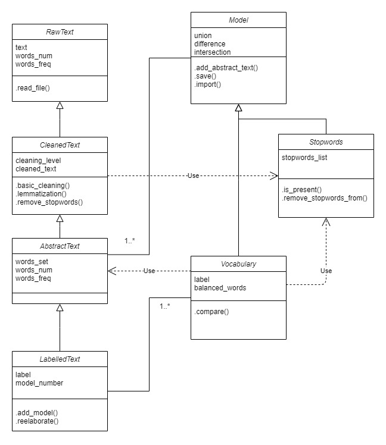
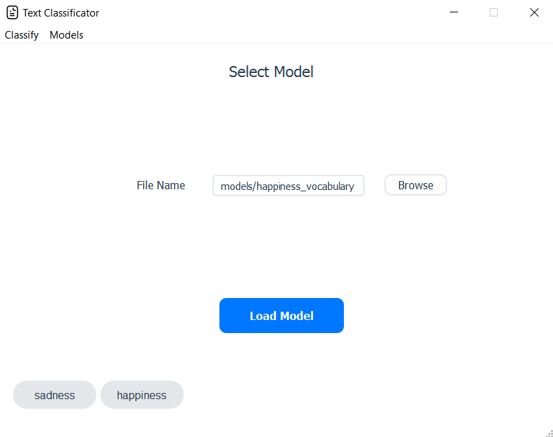
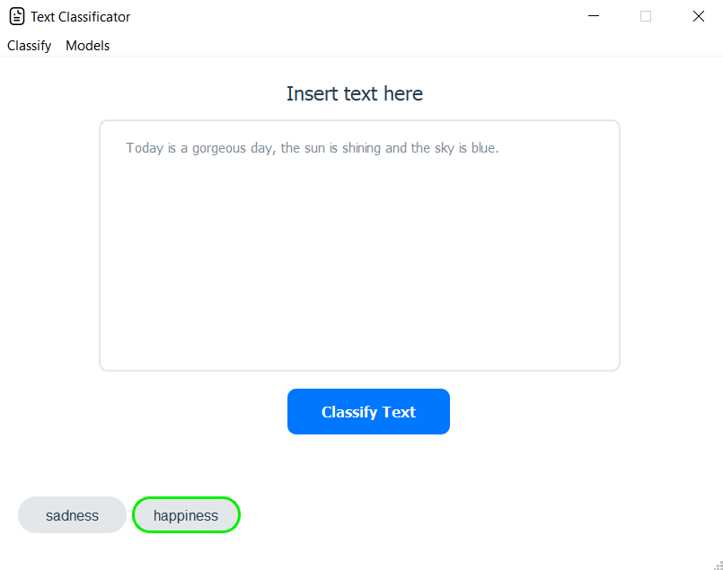
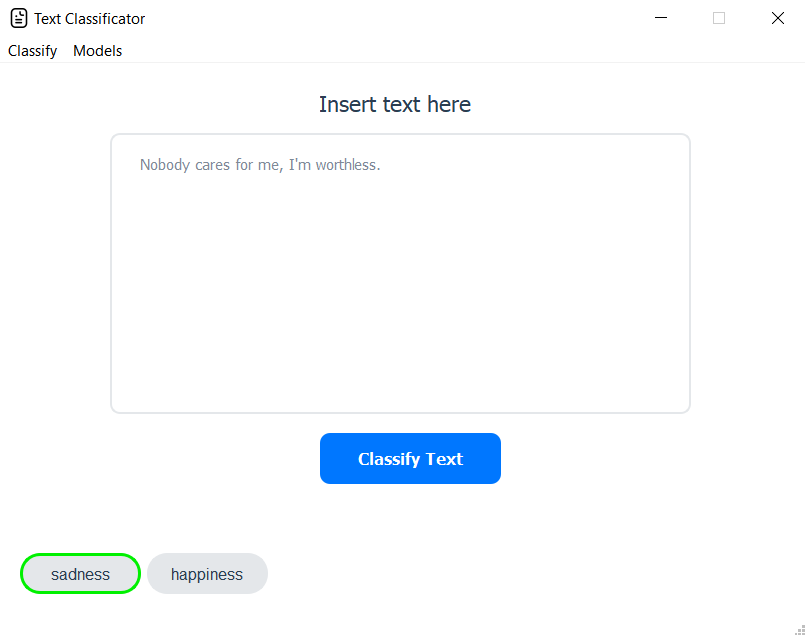

# Text Classification
Natural Language Processing in Python


## Table of Contents
* [Project Status](#project-status)
* [Getting Started](#getting-started)
* [Authors](#authors)
* [License](#license)

## Project Status

### Build

  


### Diagram




## Getting Started

### Requirements

`spacy`
`en_core_web_sm`
`PyQt5`
`matplotlib`

### How to test if everything works properly?

1. Install Requirements
  ```sh
  $ py -m pip install -r requirements.txt
  $ py -m spacy download en_core_web_sm
  ```
2. Launch *gui.py*.
  Depending on your Python interpreter installation and your OS:

  ```sh
  $ python gui.py
  ```
  or

  ```sh
  $ py gui.py
  ```
3. Go to "Models->Add"
4. Select "happiness_vocabulary" (inside /models/ folder) and Load this model
5. Select "sadness_vocabulary" (inside /models/ folder) and Load this model
6. Go to "Classify->Start Classification", insert a text and press "Classify Text"

### Samples

<kbd></kbd>
<kbd></kbd>
<kbd></kbd>

## Authors

 - Francesco Mecatti - I.T.I.S Enrico Fermi - Italy, Modena

## License
This project is licensed under the MIT license - see the [LICENSE](LICEBSE) file for details
